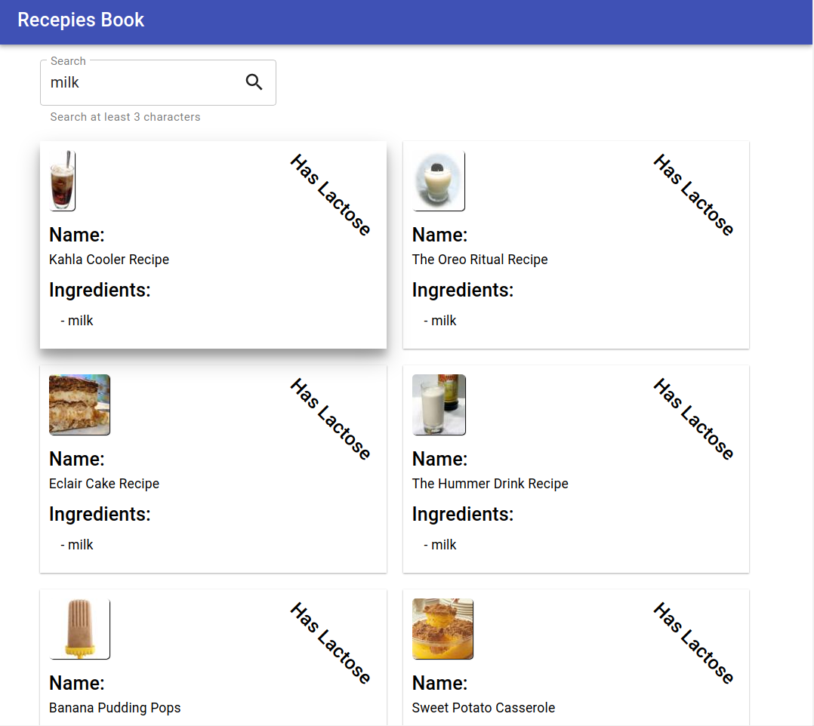

# Recipies-book

> A one-page website to search for recipies using the RecipePuppy API. 

## Implemented Features

* Searching by ingredients limited to at least 3 characters.
* Searching inputs is considering different case scenarios (e.g. " onions", ",.onions.cheese" etc.).
* Grid automatically re-size from 2 columns to 1 in case the screen size is lower than 768px. 
* Testing with Jest and Cypress.
* "Has lactose" 45% angle label if ingredients contain milk and/or cheese.

## Screenshots

**Homepage**

## Usage

* Clone this repo in your local environment using `git clone`.

* Go to the client folder `cd /client`.

* `npm install` to begin dependencies installation.

* `npm start` to run it.

* `npm test` to run the react tests.

* `npm run test:e2e` to open the cypress tests utility. If you had not run `npm start`, use `npm run test:e2e:start`.

## Built with

* [React](https://reactjs.org/) - Front end library for building user interfaces.
* [Material-UI](https://material-ui.com/) - Open-source React framework for styling.
* [Cypress](https://www.cypress.io/) - JavaScript End to End Testing Framework.
* [React-testing-library](https://testing-library.com/) - React testing utilities.

## Improvements

* Better graphic style for the single recipe card.
* Api call to RecipePuppy is using https://cors-anywhere.herokuapp.com/ to overtake Cors, possible performance issue. 
* More test in Cypress.
* Cypress is calling the real API to check if it's working, if API would have a cost per call it can be expensive.

## Authors

* Pier Andrea Delise: [GitHub](https://github.com/pierandread) - [LinkedIn](https://www.linkedin.com/in/pier-andrea-delise/)

